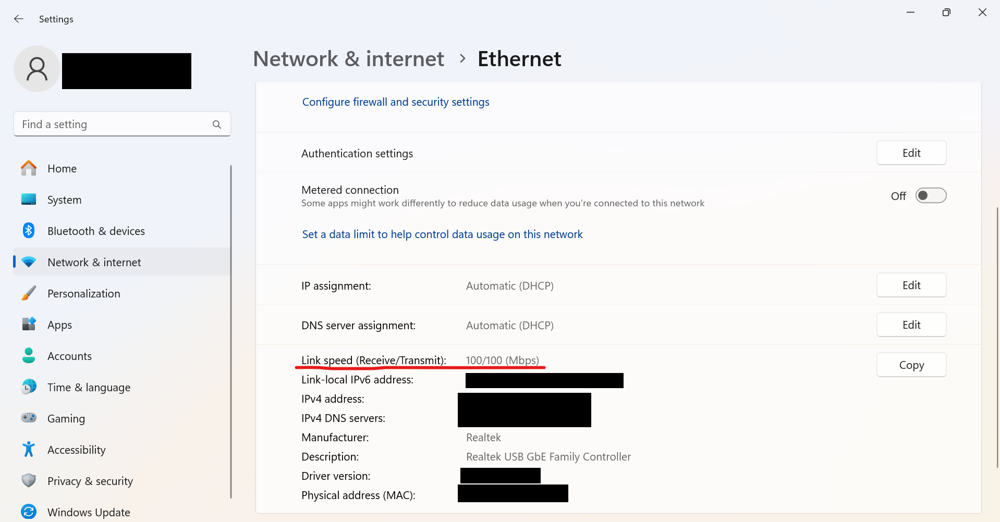
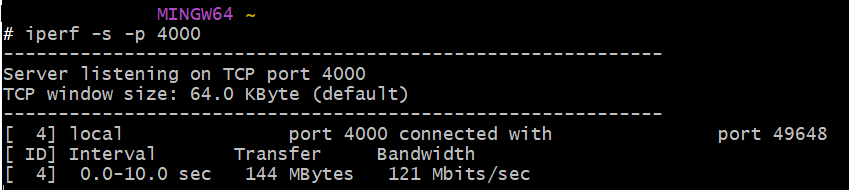
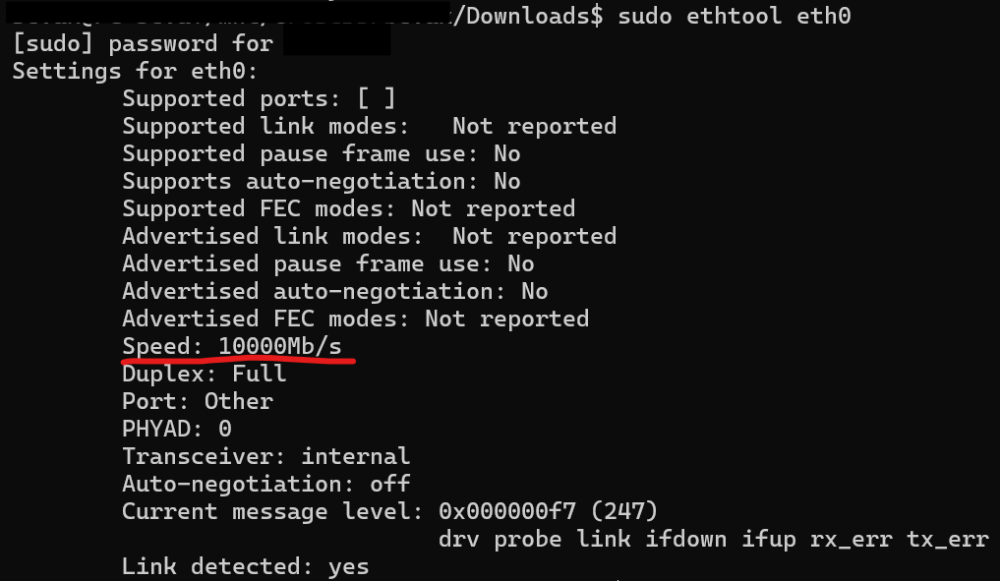

# internet-speed-check
Инструкция по проверке скорости интернета.

## LAN
Если вы в локальной сети:

### Windows
1. Максимальную скорость соединения (и IP) можно посмотреть тут:
  
2. Установите [msys2](https://github.com/msys2/msys2-installer/releases/download/2024-12-08/msys2-x86_64-20241208.exe) на каждое из устройств
3. Откройте mingw64 и выполните `pacman -S iperf --noconfirm`на каждом устройстве
4. На одном устройстве посмотрите ip адрес (шаг 1) и выполните команду `iperf -s -p 4000` (-s сервер; -p 4000 порт 4000, можно использовать любой другой не занятый)
5. На другом выполните `iperf -c ip_addr -p 4000`, заменив ip_addr на IP адресс 1 устройства
6. (опционально) Если не работает, настройте на 1 устройсве firewall: INBOUND ALLOW TCP PORT 4000
   
В случае успеха результат может выглядеть так:

### Linux
1. Скачайте пакет ethtool, напр. на ubuntu `sudo apt install -y ethtool`
2. Командой `ip a show` найдите имя правильного интерфейса, напр. `eth0`
3. Выполните `ethtool eth0`
   
5. Скачайте пакет iperf, напр. на ubuntu `sudo apt install -y iperf`, на каждом устройстве
6. На одном устройстве посмотрите ip адрес (шаг 2) и выполните команду `iperf -s -p 4000` (-s сервер; -p 4000 порт 4000, можно использовать любой другой не занятый)
7. На другом выполните `iperf -c ip_addr -p 4000`, заменив ip_addr на IP адресс **1** устройства
8. (опционально) Если не работает, настройте на **1** устройсве firewall: INBOUND ALLOW TCP PORT 4000
   
В случае успеха результат может выглядеть так:

## WAN
Если вы в разных сетях:

Дополнительно, после выполнения команды `iperf -s -p 4000` введите (в другом окне) команду

`ssh -o StrictHostKeyChecking=no -fN -R 6124:localhost:4000 serveo.net > log.txt`

заменив 6124 на произвольное число от 1000 до 20000 и ip_addr заменяйте на serveo.net, а порт на **2** устройстве на выбранное произвольное число, а не 4000.
